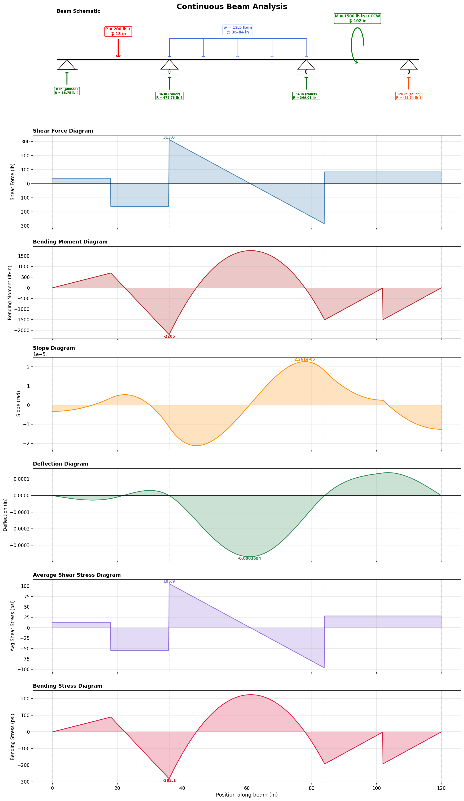

# Continuous Beam Analysis Solver

A Python tool for analyzing statically indeterminate continuous beams using the finite element method (Euler-Bernoulli beam theory). It computes support reactions, internal forces, deflections, and stresses, and produces a complete set of annotated engineering diagrams.



---

## Features

- **Any number of supports** at arbitrary positions — pinned, roller, or fixed
- **Mixed loading** — point loads, distributed loads (uniform or trapezoidal), and applied moments, in any combination
- **Imperial or metric** unit systems
- **Six output diagrams** — shear force, bending moment, slope, deflection, average shear stress, and bending stress
- **Annotated beam schematic** — a free body diagram showing all applied loads with positions, support types, and calculated reaction forces with direction arrows
- **Console output** — tabulated reactions, equilibrium check, and extreme values

---

## Requirements

- Python 3.8+
- NumPy
- Matplotlib

Install dependencies:

```bash
pip install numpy matplotlib
```

---

## Quick Start

1. Open `beam_solver.py` and edit the configuration in the `example_four_support_beam()` function at the bottom of the file.
2. Run:

```bash
python beam_solver.py
```

3. View the console output for reactions and extreme values, and the saved `beam_analysis.png` for diagrams.

---

## How to Configure Your Beam

All configuration is done by editing the example function near the bottom of the script. The following sections walk through each input.

### Unit System

```python
unit_system = "imperial"   # lengths: in, forces: lb, E: psi, stress: psi
unit_system = "metric"     # lengths: mm, forces: N,  E: MPa, stress: MPa
```

All inputs and outputs must use consistent units within the chosen system.

### Beam Length

```python
beam_length = 120.0  # total span in inches (or mm for metric)
```

### Cross-Section and Material Properties

```python
section = BeamSection(
    E=29_000_000.0,  # modulus of elasticity (psi or MPa)
    I=30.8,          # moment of inertia (in⁴ or mm⁴)
    A=2.96,          # cross-sectional area (in² or mm²)
    c=3.94,          # distance from neutral axis to extreme fiber (in or mm)
)
```

| Property | Description | Imperial | Metric |
|----------|-------------|----------|--------|
| `E` | Modulus of elasticity | psi | MPa |
| `I` | Second moment of area | in⁴ | mm⁴ |
| `A` | Cross-sectional area | in² | mm² |
| `c` | Extreme fiber distance | in | mm |

**Common material values:**

| Material | E (Imperial) | E (Metric) |
|----------|-------------|------------|
| Steel | 29,000,000 psi | 200,000 MPa |
| Aluminum | 10,000,000 psi | 69,000 MPa |
| Douglas Fir | 1,700,000 psi | 12,000 MPa |

### Supports

```python
supports = [
    Support(position=0.0,   kind="pinned"),
    Support(position=36.0,  kind="roller"),
    Support(position=84.0,  kind="roller"),
    Support(position=120.0, kind="roller"),
]
```

| Type | Vertical Displacement | Rotation | Typical Use |
|------|----------------------|----------|-------------|
| `"pinned"` | Restrained | Free | One per beam (prevents horizontal drift) |
| `"roller"` | Restrained | Free | Additional interior/end supports |
| `"fixed"` | Restrained | Restrained | Cantilever root, wall embedment |

**Stability requirement:** The beam must have enough supports to prevent rigid-body motion. Typically this means at least one pinned support plus additional rollers, or at least one fixed support.

### Point Loads

Concentrated forces applied at a single location. Positive magnitude = **downward**.

```python
point_loads = [
    PointLoad(position=18.0, magnitude=200.0),   # 200 lb downward at 18 in
    PointLoad(position=60.0, magnitude=-100.0),   # 100 lb upward at 60 in
]
```

### Distributed Loads

Line loads applied over a region. Positive intensity = **downward**, in force per unit length.

```python
# Uniform load: set w_start = w_end
distributed_loads = [
    DistributedLoad(start=36.0, end=84.0, w_start=12.5, w_end=12.5),
]

# Trapezoidal load: set different start/end intensities
distributed_loads = [
    DistributedLoad(start=0.0, end=60.0, w_start=5.0, w_end=20.0),
]

# Triangular load: set one end to zero
distributed_loads = [
    DistributedLoad(start=0.0, end=48.0, w_start=0.0, w_end=15.0),
]
```

Multiple distributed loads can overlap — their effects are superimposed.

### Applied Moments

Concentrated moments applied at a single location. Positive magnitude = **counterclockwise**.

```python
applied_moments = [
    AppliedMoment(position=102.0, magnitude=1500.0),   # 1500 lb·in CCW
    AppliedMoment(position=60.0,  magnitude=-800.0),    # 800 lb·in CW
]
```

### Solver Settings

```python
solver = ContinuousBeamSolver(
    length=beam_length,
    section=section,
    supports=supports,
    point_loads=point_loads,
    distributed_loads=distributed_loads,
    applied_moments=applied_moments,
    unit_system=unit_system,
    n_elements=800,  # mesh density — increase for smoother plots
)
```

The `n_elements` parameter controls mesh density. Higher values give smoother plots and marginally better accuracy at discontinuities, at the cost of computation time. 800 is a good default; 400 is fine for quick checks, and 1200+ for publication-quality plots.

---

## Output

### Console Output

```
══════════════════════════════════════════════════════════════
  CONTINUOUS BEAM ANALYSIS RESULTS
  Unit system: imperial
══════════════════════════════════════════════════════════════

── SUPPORT REACTIONS ─────────────────────────────────────
  x =     0.0000 in  (pinned)
      Vertical reaction:      38.7500 lb  (↑)
  x =    36.0000 in  (roller)
      Vertical reaction:     475.7812 lb  (↑)
  ...

  Sum of vertical reactions: 800.0000 lb
  Total applied load:       800.0000 lb (downward)
  Equilibrium check:        1.180636e-05 lb

── EXTREME VALUES ───────────────────────────────────────
  Max shear force:         313.5937 lb
  Max bending moment:     2204.9765 lb·in
  Max deflection:          0.000369 in
  ...
```

The **equilibrium check** shows the difference between the sum of reactions and the total applied load. Values near zero (< 0.01) confirm the solution is correct.

### Diagram Output

The plot is saved to the specified path (default: `beam_analysis.png`) and contains:

1. **Beam Schematic** — free body diagram with:
   - Support symbols (triangle for pinned, triangle + circle for roller, hatched block for fixed)
   - Reaction forces with magnitude and direction (green ↑ for upward, orange ↓ for downward/uplift)
   - Applied loads with magnitudes and positions (red for point loads, blue for distributed, green for moments)

2. **Shear Force Diagram** — internal shear force V along the beam (in force units). Jumps occur at point loads and reactions.

3. **Bending Moment Diagram** — internal bending moment M along the beam (in force × length units). Positive = sagging (tension on bottom fiber), negative = hogging (tension on top fiber).

4. **Slope Diagram** — rotation angle θ of the beam cross-section (in radians). This is the first derivative of the deflection curve.

5. **Deflection Diagram** — vertical displacement δ of the beam (in length units). Negative = downward. Zero at support locations.

6. **Average Shear Stress Diagram** — τ = V / A (in stress units). Same shape as the shear force diagram, scaled by cross-sectional area. Note: actual maximum shear stress is higher (1.5× for rectangular sections; varies for other shapes).

7. **Bending Stress Diagram** — σ = M·c / I (in stress units). Maximum fiber stress at the extreme fiber of the cross-section. Compare this to the material's allowable bending stress.

---

## Programmatic Access

The solver can also be used as a library in your own scripts:

```python
from beam_solver import (
    ContinuousBeamSolver, BeamSection, Support,
    PointLoad, DistributedLoad, AppliedMoment
)

solver = ContinuousBeamSolver(
    length=120.0,
    section=BeamSection(E=29e6, I=30.8, A=2.96, c=3.94),
    supports=[
        Support(0, "pinned"),
        Support(60, "roller"),
        Support(120, "roller"),
    ],
    distributed_loads=[
        DistributedLoad(20, 100, 10.0, 10.0),
    ],
)

solver.solve()

# Access results directly
print(solver.reactions)          # dict of {position: {vertical, moment}}
print(solver.V_plot)             # shear force array
print(solver.M_plot)             # bending moment array
print(solver.delta_plot)         # deflection array
print(solver.theta_plot)         # slope array
print(solver.tau_plot)           # average shear stress array
print(solver.sigma_plot)         # bending stress array
print(solver.x_plot)             # x-coordinate array for all plots

solver.plot(save_path="my_beam.png")   # save plot to file
solver.plot()                          # display interactively
```

---

## Sign Conventions

| Quantity | Positive Direction |
|----------|-------------------|
| Point load magnitude | Downward ↓ |
| Distributed load intensity | Downward ↓ |
| Applied moment magnitude | Counterclockwise ↺ |
| Reaction (vertical) | Upward ↑ |
| Reaction (moment, fixed) | Counterclockwise ↺ |
| Bending moment | Sagging (tension on bottom) |
| Deflection | Upward ↑ |
| Shear force | Standard beam convention (positive = clockwise couple on element) |

A **negative vertical reaction** indicates uplift — that support must be anchored to prevent the beam from lifting off.

---

## Theory

The solver uses the **direct stiffness method** with Euler-Bernoulli beam elements. Each element has two nodes with two degrees of freedom each (vertical displacement and rotation), connected by cubic Hermite shape functions.

**Assembly and solution:**
1. The beam is meshed into elements with nodes placed at all support, load, and endpoint locations.
2. Element stiffness matrices (4×4) are assembled into a global system.
3. Equivalent nodal forces are computed for distributed loads.
4. Boundary conditions are applied by constraining DOFs at support locations.
5. The reduced system Kf · Uf = Ff is solved for unknown displacements.
6. Reactions are recovered from R = K · U - F.

**Post-processing:**
- Deflection and slope are read directly from the solution vector.
- Bending moment is computed from the second derivative of the displacement field: M = EI · v″, evaluated using Hermite shape function derivatives.
- Shear force is computed from the third derivative: V = EI · v‴ (constant per element).
- Stresses are computed from the internal forces: σ = M·c/I and τ = V/A.

---

## Limitations

- **Euler-Bernoulli theory** — assumes plane sections remain plane and neglects shear deformation. Accurate for slender beams (length/depth > 10). For deep beams, Timoshenko beam theory would be more appropriate.
- **Prismatic beam** — the cross-section (E, I, A, c) is constant along the entire length. Stepped or tapered beams are not supported.
- **Linear elastic** — assumes small deflections and linear material behavior. Not suitable for plastic analysis or large-deformation problems.
- **Average shear stress** — the reported shear stress is V/A, which is a simplification. The actual shear stress distribution depends on the cross-section shape (parabolic for rectangular, concentrated in the web for I-beams).
- **No self-weight** — the beam's own weight is not automatically included. Add it as a distributed load if needed.
- **2D analysis** — vertical loads and in-plane bending only. No lateral-torsional buckling, biaxial bending, or axial loads.

---

## Troubleshooting

| Issue | Cause | Fix |
|-------|-------|-----|
| "Stiffness matrix is singular" | Beam is a mechanism (insufficient supports) | Add supports to prevent rigid-body motion |
| Equilibrium check > 0.1 | Mesh too coarse or numerical issues | Increase `n_elements` |
| Reactions don't match hand calculations | Check sign conventions | Positive loads = downward; positive moments = CCW |
| Plot looks jagged | Mesh too coarse | Increase `n_elements` to 800+ |
| Very large deflections | Units mismatch | Verify E, I, and length are in consistent units |

---

## License

This tool is provided as-is for educational and engineering use. The user is responsible for verifying results and ensuring they are appropriate for their application. This tool is not a substitute for professional structural engineering judgment.
